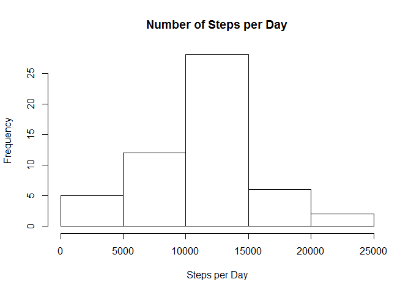
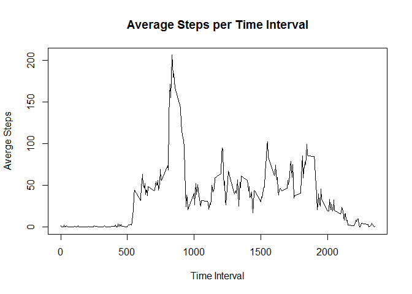
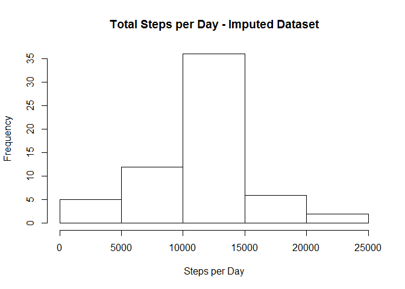
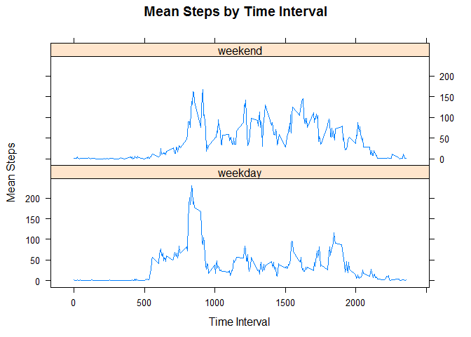

# Reproducible Research: Peer Assessment 1


## Loading and preprocessing the data

#### 1. Load the data (i.e. read.csv())

```r
activity_data <- read.csv(unz("activity.zip",filename="activity.csv"))
```

#### 2. Process/transform the data (if necessary) into a format suitable for your analysis
#### Not Necessary


## What is mean total number of steps taken per day?

#### 1. Calculate the total number of steps taken per day

```r
steps_day <- aggregate(activity_data$steps, list(activity_data$date), sum)
names(steps_day) <- c("date","total_steps")
```

#### 2. Make a histogram of the total number of steps taken each day

```r
hist(steps_day$total_steps
     , main = "Number of Steps per Day"
     , xlab = "Steps per Day")
```

 

#### 3. Calculate and report the mean and median of the total number of steps taken per day

```r
mean(steps_day$total_steps, na.rm = TRUE)
```

```
## [1] 10766.19
```

```r
median(steps_day$total_steps, na.rm = TRUE)
```

```
## [1] 10765
```

## What is the average daily activity pattern?

#### 1. Make a time series plot (i.e. type = "l") of the 5-minute interval (x-axis) and the average number of steps taken, averaged across all days (y-axis)

```r
mean_steps_time <- aggregate(x = activity_data$steps
                             , by = list(activity_data$interval)
                             , FUN = mean, na.rm = TRUE)
names(mean_steps_time) <- c("interval","mean_steps")

plot(mean_steps_time$interval
     ,mean_steps_time$mean_steps
     ,type="l"
     ,main="Average Steps per Time Interval"
     ,xlab="Time Interval"
     ,ylab="Averge Steps")
```

 

#### 2. Which 5-minute interval, on average across all the days in the dataset, contains the maximum number of steps?

```r
mean_steps_time$interval[mean_steps_time$mean_steps 
                         == max(mean_steps_time$mean_steps, na.rm = TRUE)]
```

```
## [1] 835
```

## Imputing missing values

#### 1. Calculate and report the total number of missing values in the dataset (i.e. the total number of rows with NAs)

```r
sum(!complete.cases(activity_data))
```

```
## [1] 2304
```

#### 2. Devise a strategy for filling in all of the missing values in the dataset. The strategy does not need to be sophisticated. For example, you could use the mean/median for that day, or the mean for that 5-minute interval, etc.

#### Missing values will be filled in using the mean for that 5-minute interval.

#### 3. Create a new dataset that is equal to the original dataset but with the missing data filled in.

```r
## Merge activity data with time interval steps average
activity_data_imputed <- merge(activity_data, mean_steps_time
                ,by.x = "interval", by.y = "interval"
                , all.x = TRUE)

## Fix ordering after the merge
activity_data_imputed <- activity_data_imputed[order(activity_data_imputed$date
                                                     ,activity_data_imputed$interval),]

## Select the interval step average where step count is NA
## if not NA use the original value.
activity_data_imputed$steps <- ifelse(is.na(activity_data_imputed$steps)
                                     , activity_data_imputed$mean_steps
                                     , activity_data_imputed$steps)

## Remove interval step average
activity_data_imputed$mean_steps <- NULL

## Remove row.names
row.names(activity_data_imputed) <- NULL
```

#### 4. Make a histogram of the total number of steps taken each day and Calculate and report the mean and median total number of steps taken per day. Do these values differ from the estimates from the first part of the assignment? What is the impact of imputing missing data on the estimates of the total daily number of steps?

```r
## Calculate the total number of steps per day with filled in dataset
steps_day <- aggregate(activity_data_imputed$steps
                       , list(activity_data_imputed$date)
                       , sum)
names(steps_day) <- c("date","total_steps")

## Make histogram of total number of steps per day
hist(steps_day$total_steps
     , main = "Total Steps per Day - Imputed Dataset"
     , xlab = "Steps per Day")
```

 

```r
## Calculate mean and median values
mean(steps_day$total_steps)
```

```
## [1] 10766.19
```

```r
median(steps_day$total_steps)
```

```
## [1] 10766.19
```

#### These results are very similiar to results from the first part of the assignment.  This shows that imputing missing values using the 5-minute interval average had little impact on the mean and meadian values.

## Are there differences in activity patterns between weekdays and weekends?

#### For this part the weekdays() function may be of some help here. Use the dataset with the filled-in missing values for this part.

#### 1. Create a new factor variable in the dataset with two levels - "weekday" and "weekend" indicating whether a given date is a weekday or weekend day.

```r
activity_data_imputed$weekday_ind <- as.factor(ifelse(weekdays(as.Date(activity_data_imputed$date))
                                            %in% c("Monday","Tuesday","Wednesday"
                                                   ,"Thursday","Friday")
                            , "weekday","weekend"))
```

#### 2. Make a panel plot containing a time series plot (i.e. type = "l") of the 5-minute interval (x-axis) and the average number of steps taken, averaged across all weekday days or weekend days (y-axis). See the README file in the GitHub repository to see an example of what this plot should look like using simulated data.

```r
## Calculate average steps by interval and weekday or weekend
interval_weekday_mean <- aggregate(x = activity_data_imputed$steps
                             , by = list(activity_data_imputed$weekday_ind
                                         ,activity_data$interval)
                             , FUN = mean, na.rm = TRUE)
names(interval_weekday_mean) <- c("weekday_ind","interval","mean_steps")

library(lattice)
xyplot(mean_steps ~ interval | weekday_ind
       ,data = interval_weekday_mean
       ,type = "l"
       ,layout = c(1,2)
       ,main="Mean Steps by Time Interval"
       ,xlab="Time Interval"
       ,ylab="Mean Steps")
```

 
